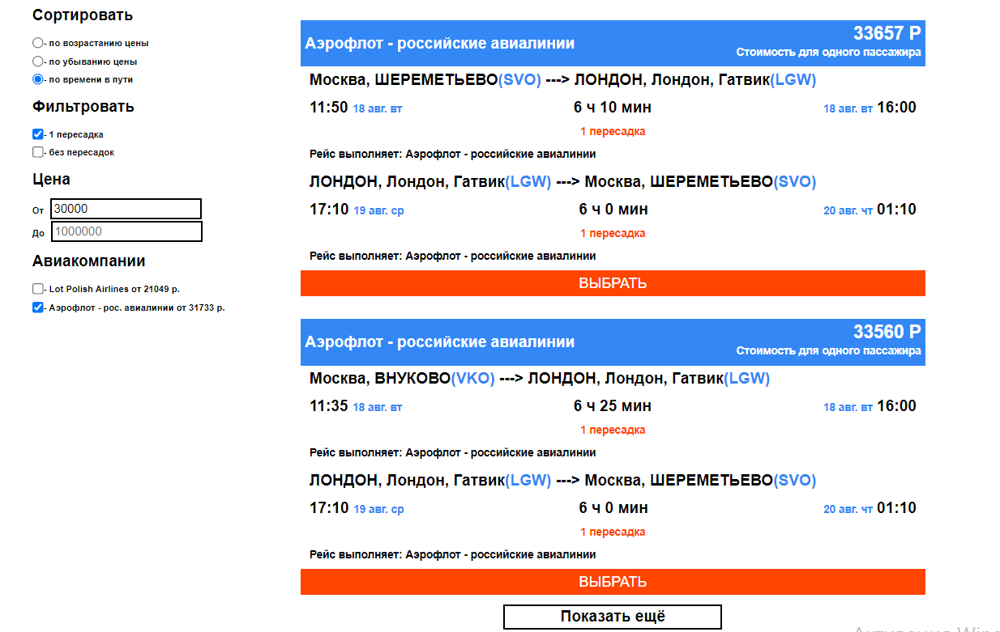

# Тестовое задание

> SPA для поиска авиабилетов по нужным параметрам. 

https://avia-jade.vercel.app/

## Описание

В данном приложении мы можем искать билеты в пункт назначения и обратно. Эти билеты мы можем сортировать по возрастанию цены, убыванию цены и по времени в пути. Можем фильтровать билеты с пересадками или без. Так же искать билеты в необходимом денежном диапазоне и в любимых авиакомпаниях.

Изначально выводится по 2 билеты, которые соответсвуют всем заданым фильтрам. При нажатии кнопки "Показать еще" будет выводиться еще два дополнительных билета.

## Команды

<table>
  <thead>
    <tr>
      <th>Команда</th>
      <th>Результат</th>
    </tr>
  </thead>
  <tbody>
    <tr>
      <td width="30%"><code>npm install</code></td>
      <td>Установить зависимости</td>
    </tr>
    <tr>
      <td><code>npm start</code></td>
      <td>Запустить приложение в режиме разработки.</td>
    </tr>
     <tr>
      <td><code>npm test</code></td>
      <td>Запуск тестов</td>
    </tr>
    <tr>
      <td><code>npm run build</code></td>
      <td>Собрать проект для продакшена</td>
    </tr>
  </tbody>
</table>

## Используемые технологии

React, React Hooks

